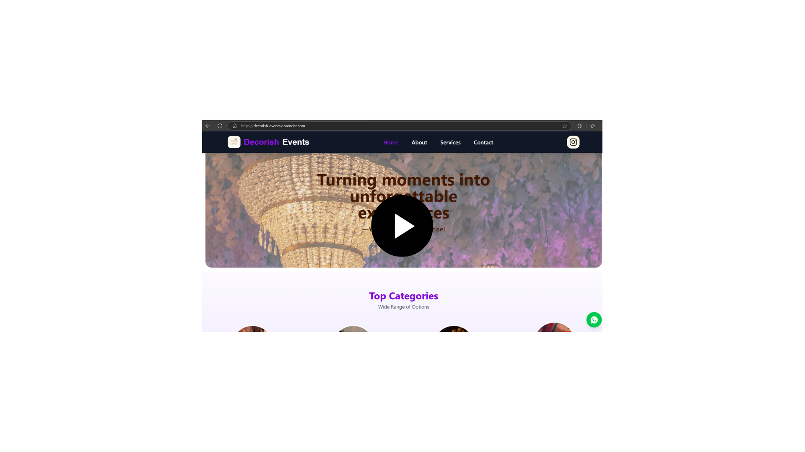

## 🎬 Watch Demo

)

🎉 Decorish Events Web App

Welcome to the  Decorish Events Solutions website repository!
This is a fully responsive and elegant website that provide event decoration services — including birthdays, anniversaries, farewells, and other celebrations.

🌟 It is designed to deliver a professional, modern, and user-friendly experience.

📂 Project Structure

src/
│
├── assets/               # Images, videos, and other assets
├── components/           # Reusable components (hero section, about section, services section)
│    ├── about-section/
│    ├── hero-section/
│    ├── services-section/
│    ├── GoogleMapPreview.jsx
│    └── Popup.jsx
│
├── main-components/      # Main pages (About, Services, Contact, Home, Navbar, Footer)
│    ├── About.jsx
│    ├── ContactPage.jsx
│    ├── Footer.jsx
│    ├── Home.jsx
│    ├── Navbar.jsx
│    ├── NotFound.jsx
│    └── Services.jsx
│
├── App.jsx                # App routes and layout
├── App.css                # Global styles
├── index.css              # Tailwind and custom styles
└── main.jsx               # Entry point

✨ Features
Fully responsive for mobile, tablet, and desktop.

* Beautiful animated hero section.

* Interactive services section highlighting event categories.

* About page to describe company vision and mission.

* Contact page with embedded Google Maps.

* Popup feature for announcements or offers.

* Error handling with a custom 404 page.

* Built with React.js, Tailwind CSS, and Framer Motion.

🚀 Technologies Used

* React.js

* Tailwind CSS

* Framer Motion (for animations)

* Vite (for fast build and development)

* Google Maps Embed API

📞 Contact
Feel free to reach out for any queries or collaborations!
Made with ❤️ by Ishant Ahuja
