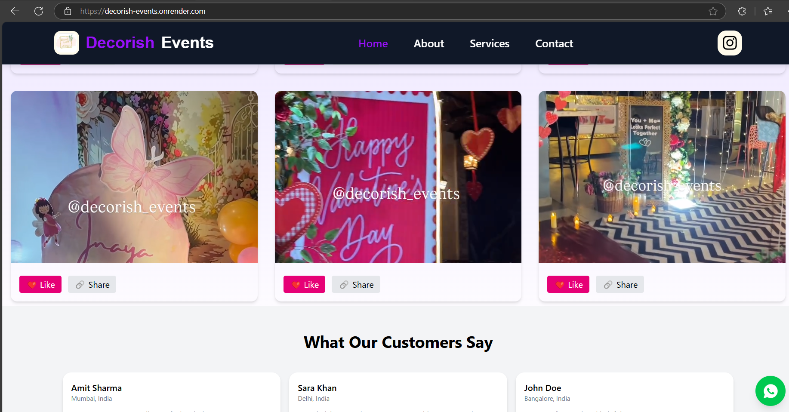
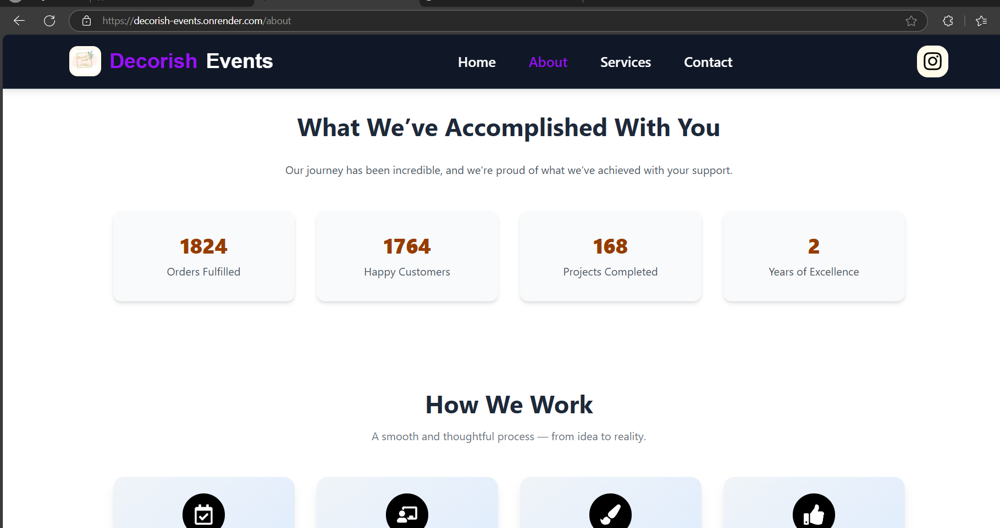
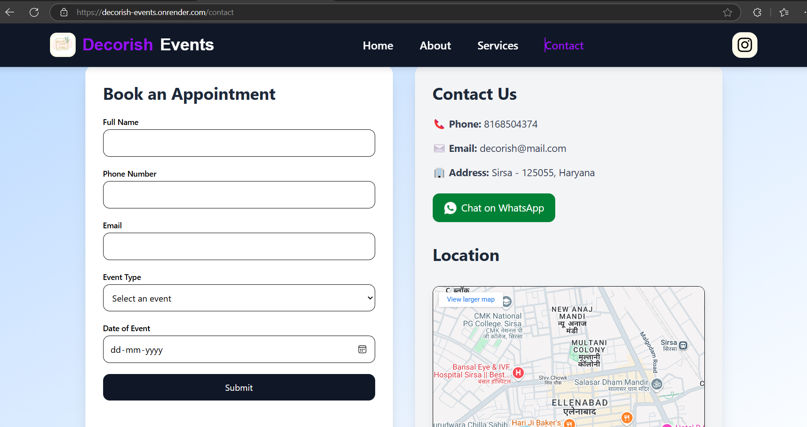

# 🎉 Decorish Events Web App

Welcome to the **Decorish Events Solutions** website repository!  
A modern, responsive, and elegant platform for booking **event decoration services** — including **birthdays**, **anniversaries**, **farewells**, and other special occasions.

🌟 Designed for a professional, aesthetic, and seamless user experience.

---

## 🚀 Live Demo

🌐 Visit the deployed website: [Decorish Events →](https://decorish-events.onrender.com)

🎬 Watch the demo video: [Watch on Google Drive →](https://drive.google.com/file/d/1POoMxZqlAXwMaEO5jbJ4_-MvwadsS2Lw/view?usp=drive_link)

📸 Preview Images  
<p float="left">
  
  
  
</p>

 ## 📱 Responsive Design Showcase
 
<p float="left">
  
</p>

Our design adapts beautifully across all screen sizes: desktop, tablet, and mobile.

---

## 🛠️ Available Scripts

In the project directory, you can run:

npm run dev
Starts the development server.
Visit: http://localhost:3000
Live reload with saved changes and lint error highlighting.

bash
Copy
Edit
npm run build
Builds the app for production into the dist/ folder.
React is bundled in production mode and optimized for performance.

## 🚀 Tech Stack

⚛️ React – Frontend JavaScript library

🎨 Tailwind CSS – Utility-first CSS framework for styling

📧 Custom Email API – Handles form submissions

⚡ Vite – Fast build tool and dev server for modern web projects

## 🧩 Features  

📝 Book event decoration services easily

📱 Fully responsive design across devices

📌 Interactive Google Map preview of event location

🪄 Animated service previews with category filtering

💬 Integrated contact form to send messages via email

🌈 Visually aesthetic, modern UI with smooth transitions

## 📂 Project Structure

```text
📦 src/
├── 📁 assets/
├── 📁 components/
│ ├── 📁 about-section/
│ ├── 📁 hero-section/
│ ├── 📁 services-section/
│ ├── 📄 GoogleMapPreview.jsx
│ └── 📄 Popup.jsx
├── 📁 main-components/
│ ├── 📄 About.jsx
│ ├── 📄 ContactPage.jsx
│ ├── 📄 Footer.jsx
│ ├── 📄 Home.jsx
│ ├── 📄 Navbar.jsx
│ ├── 📄 NotFound.jsx
│ └── 📄 Services.jsx
├── 📄 App.jsx
├── 📄 App.css
├── 📄 index.css
└── 📄 main.jsx
```


## 📦 Installation & Setup
Clone the repo and install dependencies:

bash
Copy
Edit
git clone https://github.com/IshantAhuja0/decorish-events.git
cd decorish-events
npm install
npm run dev
Visit http://localhost:3000 to view it locally.

🤝 Contributing
Contributions, suggestions, and improvements are welcome!

Fork the repository

Create a new branch (git checkout -b feature/your-feature-name)

Commit your changes (git commit -m 'Add some feature')

Push to the branch (git push origin feature/your-feature-name)

Open a Pull Request

📄 License
This project is licensed under the MIT License.


📞 Contact
For queries or feedback:
📧 decorish.events@gmail.com
📸 Follow us on Instagram 

